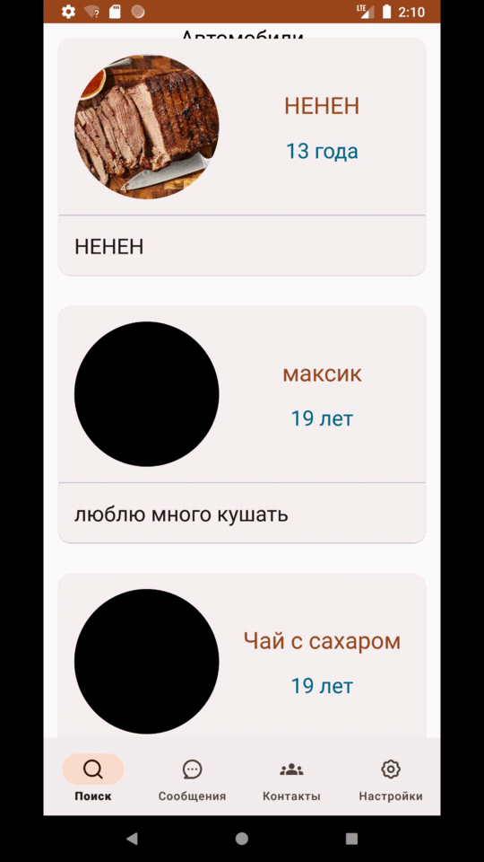
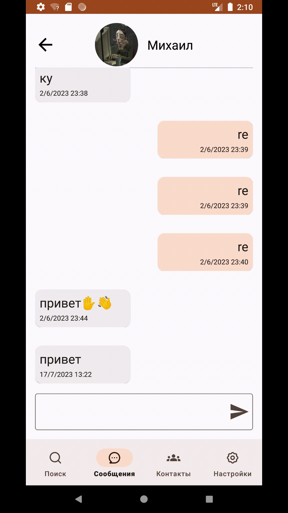
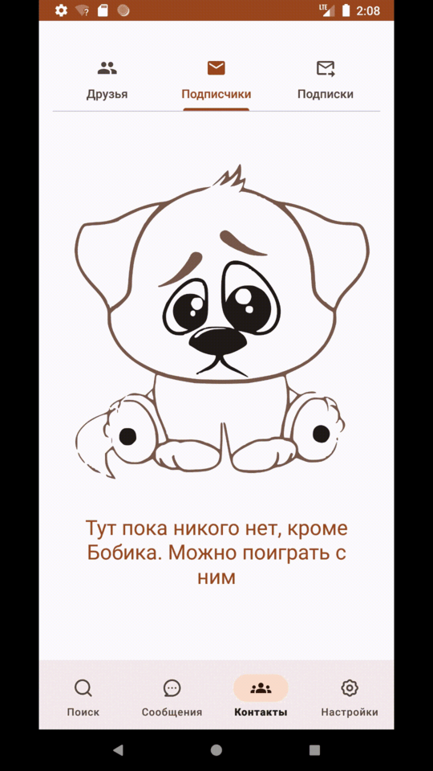

# Название приложения: Friended

## Описание:

Friended - это мобильное приложение, которое помогает пользователям находить друзей по общим интересам. Приложение предлагает удобный способ найти людей, которые разделяют ваши увлечения, и общаться с ними.

## Основные функции:

- **Профиль пользователя:**
  - Позволяет пользователям создавать свой профиль, указывать свои интересы, добавлять информацию о себе и загружать фотографии.
    
    
 

- **Поиск друзей:**
  - Позволяет пользователям находить других людей с похожими интересами и устанавливать контакт с ними.
    
    

- **Сообщения:**
  - Предоставляет возможность обмениваться сообщениями с найденными друзьями для обсуждения общих интересов и планирования встреч.
  - Доступно создания групповых чатов для более интересного и захватывающего общения.
    
    
    
- **Список контактов:**
    - Позволяет взаимодействовать с друзьями и реагировать на новые заявки дружбы от других пользователей.
      
      
## Технологии:

- **Frontend:**
  - Разметка приложения написана на языке разметки XML

- **Хранение данных:**
  - Для хранения данных были использованы сервисы Firebase.
- **Библиотеки:**
  - RxJava2
  - Retrofit
  - Glide
  - Firebase
